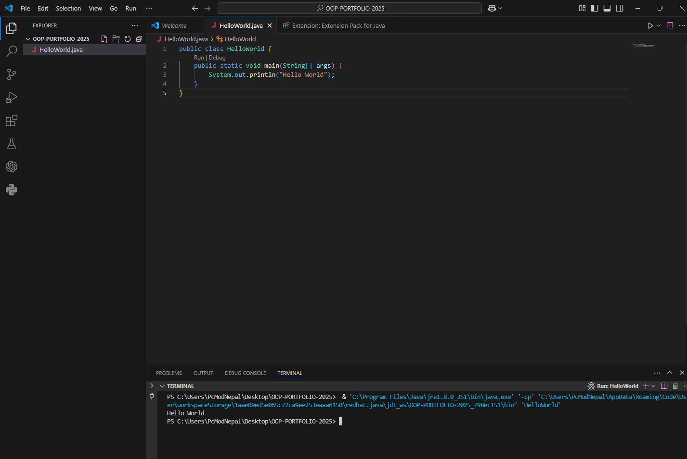
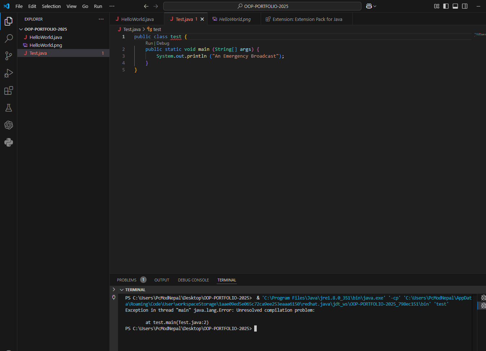
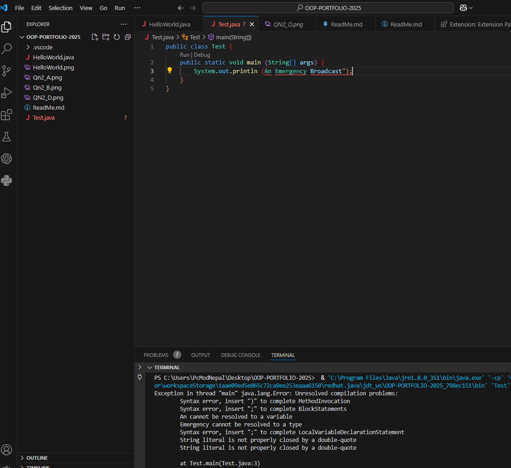
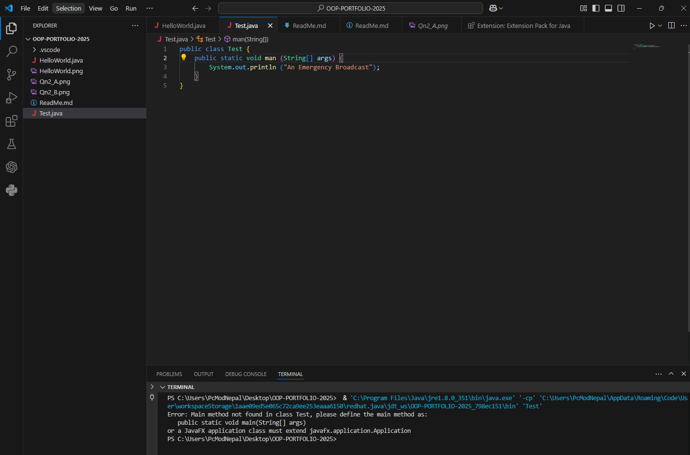
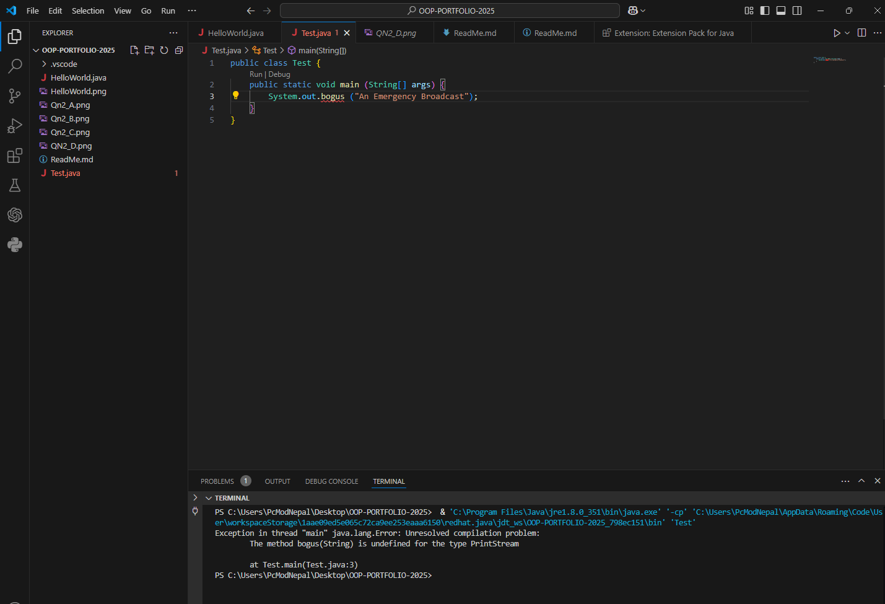
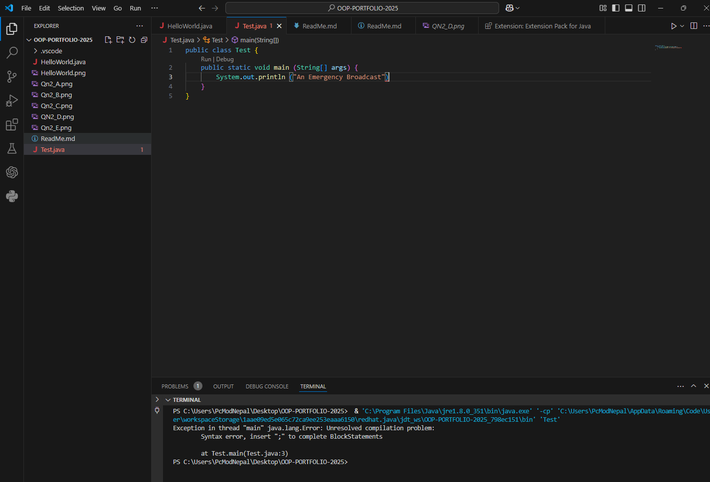
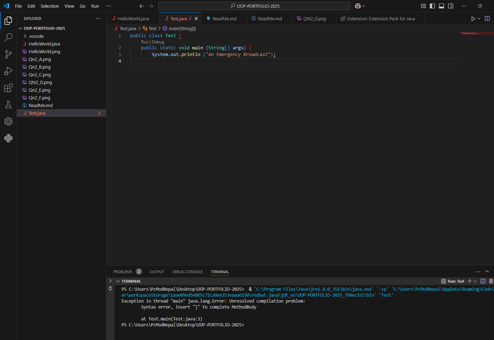
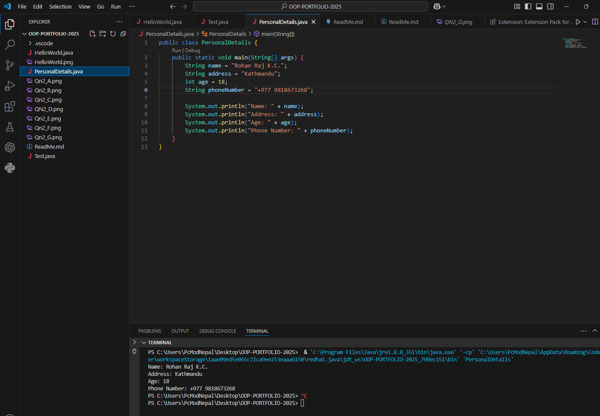
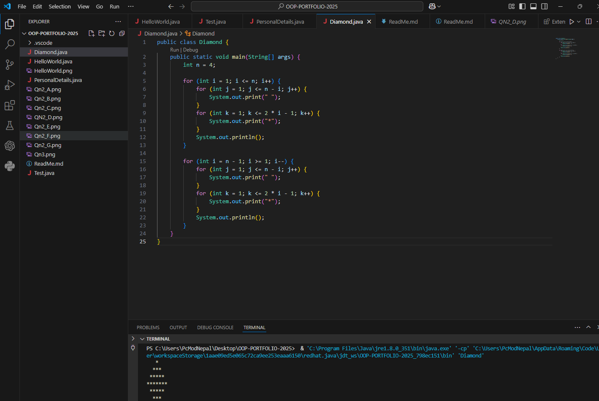

1 Hello World        ${\color{green}-- todo}$\
2 Test               ${\color{green}-- todo}$\
3 Personal Details   ${\color{green}-- todo}$\
4 Diamonds           ${\color{green}-- todo}$\
5 Questions          ${\color{green}-- todo}$

Please replace ${\color{green}-- todo}$ with ${\color{blue}-- completed}$ once done.

---

For each question in the exercise, please either display the output generated by running the program, or the answer if the task is a question.

1 - 

--- Hello World 

2 -

--- a. Exception in thread "main" java.lang.Error: Unresolved compilation problem: at test.main(Test.java:2) 

--- b. An emergency Broadcast 
--- c. Exception in thread "main" java.lang.Error: Unresolved compilation problems: 
        Syntax error, insert ")" to complete MethodInvocation
        Syntax error, insert ";" to complete BlockStatements
        An cannot be resolved to a variable
        Emergency cannot be resolved to a type
        Syntax error, insert ";" to complete LocalVariableDeclarationStatement
        String literal is not properly closed by a double-quote
        String literal is not properly closed by a double-quote
        
--- d. Error: Main method not found in class Test, please define the main method as: 
         public static void main(String[] args)
         or a JavaFX application class must extend javafx.application.Application

--- e. Exception in thread "main" java.lang.Error: Unresolved compilation problem: 
        The method bogus(String) is undefined for the type PrintStream

--- f. Syntax error, insert ";" to complete BlockStatements 

        at Test.main(Test.java:3) 

--- g. xception in thread "main" java.lang.Error: Unresolved compilation problem: 

        Syntax error, insert "}" to complete MethodBody

        at Test.main(Test.java:3)
3 - 

---Name: Rohan Raj K.C.
Address: Kathmandu
Age: 18
Phone Number: +977 9818673268

4 -
 

---er\workspaceStorage\1aae09ed5e065c72ca9ee253eaaa6150\redhat.java\jdt_ws\OOP-PORTFOLIO-2025_798ec151\bin' 'Diamond' 
   *
  ***
 *****
*******
 *****
  ***
   *

5 -
--- a . The latest version is JDK 21
--- b. 
Java SE: For desktop, server, and standalone apps.

Java ME: For mobile and embedded devices with limited resources
--- c. Java works on Windows, macOS, Linux, and other Unix-based system
--- d. The most popular IDE is IntelliJ IDEA
--- e. The main() function is the entry point of a Java program. It’s where the program starts execution.

